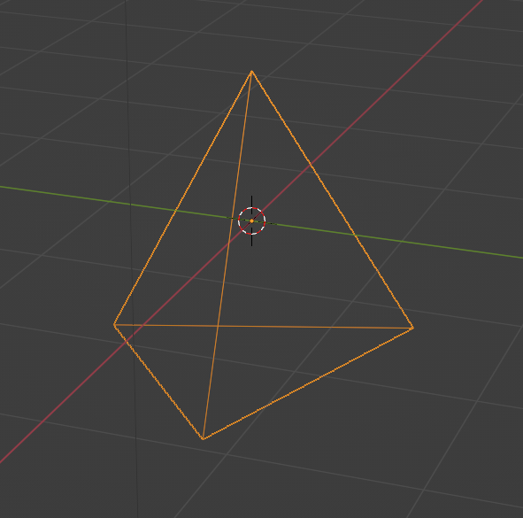

# PLYtoGX

PLYtoGX is a script capable of converting PLY 3D models into a corresponding set of libOGC GX calls.  It can recognize triangularized meshes only and will operate on:

- Vertices
- Normals
- UV coords
- Vertex Colors (with or without alpha)

>Note: Vertex coordinates, UV coordinates, and Normals are stored in float32 format.
Vertex Colors are stored in RGB(A)_888(8) format.

## Usage

	GXConvert2.py [-h] [-b B] [-s S] [-e E] FILE
	  FILE        PLY file to process
	options:
	  -h, --help  show this help message and exit
	  -b B        Output path for binary blob
	  -s S        Output path for generated C file
	  -e E        Output path for generated H file
	  
The program will generate a binary `.mdl` file along with associated C and header files.  The `.mdl` should be processed as part of your makefile in a similar way to other binary blobs.  A small snippet like this in any libOGC makefile will handle it:

	%.mdl.o	:	%.mdl
	#---------------------------------------------------------------------------------
		@echo $(notdir $<)
		$(bin2o)

## How it Works

PLYtoGLX packs model information into a flat binary blob `<model>.mdl` and configures the GX subsystem for Indirect Mode, allowing it to automatically index into the blob without CPU intervention.  Additionally, the indices themselves are packed into a read-only array to further reduce code size.

The generated code stores color and UV information into their respective TEV channel 0s, although this can be changed by editing the resulting `draw_<model>.c` file.

## Example Pyramid

Here's a simple pyramid

Which is represented by this ply file:

	ply
	format ascii 1.0
	comment Created by Blender 3.2.0 - www.blender.org
	element vertex 4
	property float x
	property float y
	property float z
	element face 4
	property list uchar uint vertex_indices
	end_header
	-0.856242 0.856242 -0.977821
	0.000000 0.000000 1.000000
	1.137685 0.112052 -0.992718
	-0.218203 -1.096980 -0.994841
	3 0 1 2
	3 2 1 3
	3 3 1 0
	3 2 3 0
	
After processing with `GXConvert.py example/triangle.ply -b ~/prj/data -s ~/prj/src -e ~/prj/inc` the following are generated:

	PLYtoGX v1.0
	Name:triangle Vertices:4 Faces:12
	HasVtx:True HasNorm:False HasUv:False
	HasColor:False HasColorAlpha:False
	Packing binary model triangle.mdl ...
	Generating C file draw_triangle.c ...
	Generating H file draw_triangle.h ...

### Generated Binary MDL File
	 $ od -Ax -t f4x1 --endian big triangle.mdl 
	000000       -0.856242        0.856242       -0.977821               0
		bf  5b  32  ad  3f  5b  32  ad  bf  7a  52  7a  00  00  00  00
	000010               0               1        1.137685        0.112052
		00  00  00  00  3f  80  00  00  3f  91  9f  a9  3d  e5  7b  85
	000020       -0.992718       -0.218203        -1.09698       -0.994841
		bf  7e  22  c4  be  5f  70  9b  bf  8c  69  d7  bf  7e  ad  e6

### Generated C File

	#include <ogc/gx.h>
	#include "triangle_mdl.h"
	static const u8 vtxArr[] = {0,1,2,2,1,3,3,1,0,2,3,0,};
	void draw_triangle(void) {
		GX_ClearVtxDesc();
		GX_SetArray(GX_VA_POS, (void*)triangle_mdl+0, 12);
		GX_SetVtxDesc(GX_VA_POS, GX_INDEX8);
		GX_SetVtxAttrFmt(GX_VTXFMT0, GX_VA_POS, GX_POS_XYZ, GX_F32, 0);
		GX_Begin(GX_TRIANGLES, GX_VTXFMT0, 12);
		for(size_t i = 0; i<12; i++){
			GX_Position1x8(vtxArr[i]);
		}
		GX_End();
	}

## Using Textures (UNTESTED)

Texture data is not stored in PLY files and devkitPPC has a special, standardized mechanism for managing texture data [as seen here](https://devkitpro.org/wiki/libogc/GX#Textures).  You will need to export your properly UV mapped texture into a standard 2D image format for conversion and linking. Take a look at [this example project](https://github.com/devkitPro/gamecube-examples/tree/master/graphics/gx/texturetest) for more details on general texture use.

Before drawing the model, it is necessary to load the appropriate texture palette into memory.  The simplest example (using the default `GX_TEXMAP0` and `GX_TEVSTAGE0`) would be:

	TEX_GetTexPalette(&tpl, "gxTextures.tpl");
	TEX_GetTexObjFromPalette(tpl, &texObj, <MODEL_TEX_ID>);
	GX_LoadTexObj(&texObj, GX_TEXMAP0);
	GX_SetTevOp(GX_TEVSTAGE0, GX_MODULATE);
	draw_<model>();
